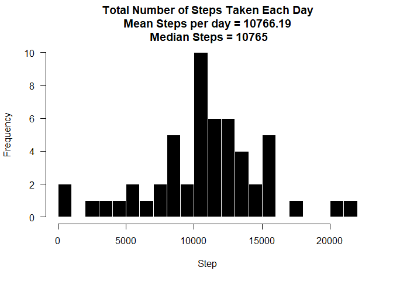
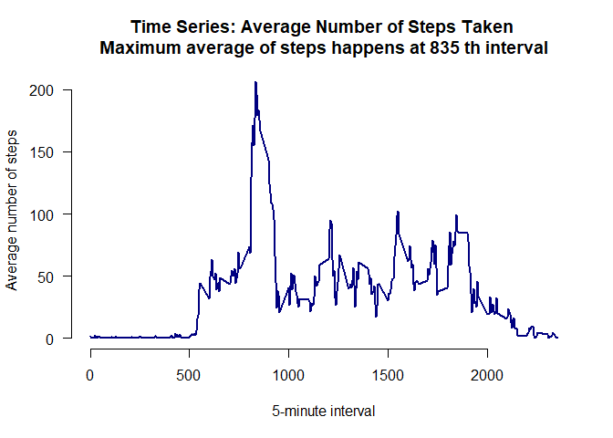
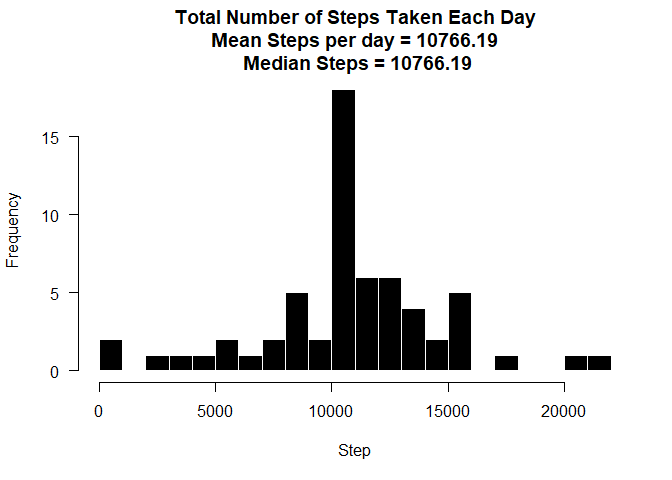
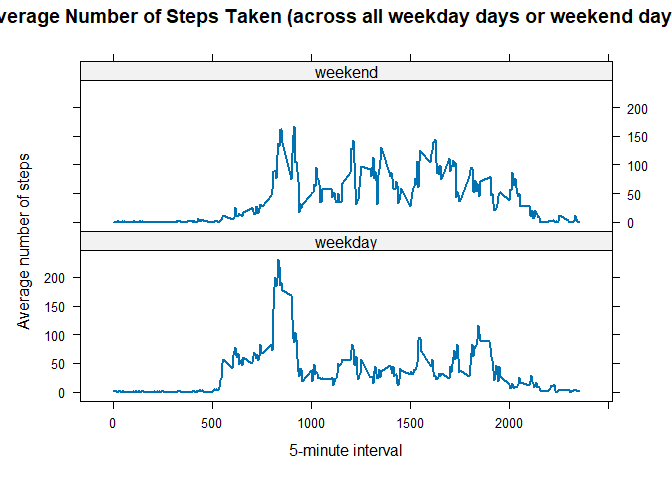

## Loading and preprocessing the data

```r
# Downloading and uploading data
temp <- tempfile()
download.file("https://d396qusza40orc.cloudfront.net/repdata%2Fdata%2Factivity.zip",temp)

activity <- read.csv(unzip(temp,"activity.csv"))
unlink(temp)

activity$date <- as.Date(activity$date, format = "%Y-%m-%d")
```


## What is mean total number of steps taken per day?

```r
# Load package for group_by function
library(dplyr)
```

```
## Warning: package 'dplyr' was built under R version 4.3.1
```

```
## 
## Attaching package: 'dplyr'
```

```
## The following objects are masked from 'package:stats':
## 
##     filter, lag
```

```
## The following objects are masked from 'package:base':
## 
##     intersect, setdiff, setequal, union
```

```r
# Calculate the total number of steps taken per day, excludind NAs
steps <- activity[!is.na(activity),] %>% group_by(date) %>% summarise(total_per_day = sum(steps))

# Clear NAs
steps <- steps %>% na.omit()

# use base plotting system and more bins than the default setting
hist(steps$total_per_day, breaks = 20, 
     main = paste("Total Number of Steps Taken Each Day\n",
                  "Mean Steps per day =",round(mean(steps$total_per_day),2),"\n",
                  "Median Steps =", median(steps$total_per_day)),
     col = "black", border = "white", xlab = "Step", axes = FALSE)
axis(1)
axis(2, las = 1)
```

<!-- -->


## What is the average daily activity pattern?
Time series plot of the average number of steps taken


```r
library(stats)
avg_step <- aggregate(steps ~ interval, data = activity, mean, na.rm = TRUE)
plot(avg_step$interval, avg_step$steps, type = "l", lwd = 2, col = "navy",
     main = paste("Time Series: Average Number of Steps Taken \nMaximum average of steps happens at",avg_step$interval[which.max(avg_step$steps)],"th interval"),
                  , axes = FALSE,
     xlab = "5-minute interval", ylab = "Average number of steps")
axis(1)
axis(2, las = 1)
```

<!-- -->

## Imputing missing values
Calculate the number of missing values


```r
sum(is.na(activity))
```

```
## [1] 2304
```

As there are 2304 NAs, this code will implement 5-min average to fill these gaps in database.


```r
df <- activity # new dataset called imp
for (i in avg_step$interval) {
    df[df$interval == i & is.na(df$steps), ]$steps <- avg_step$steps[avg_step$interval == i]
}
```


```r
steps <- df %>% group_by(date) %>% summarise(total_per_day = sum(steps))

# Clear NAs
steps <- steps %>% na.omit()

# use base plotting system and more bins than the default setting
hist(steps$total_per_day, breaks = 20, 
     main = paste("Total Number of Steps Taken Each Day\n",
                  "Mean Steps per day =",round(mean(steps$total_per_day),2),"\n",
                  "Median Steps =", round(median(steps$total_per_day),2)),
     col = "black", border = "white", xlab = "Step", axes = FALSE)
axis(1)
axis(2, las = 1)
```

<!-- -->

## Are there differences in activity patterns between weekdays and weekends?


```r
df$day <- weekdays(df$date)
df$week <- ""
df[df$day == "sábado" | df$day == "domingo", ]$week <- "weekend"
df[!(df$day == "sábado" | df$day == "domingo"), ]$week <- "weekday"
df$week <- factor(df$week)

avg_step_df <- aggregate(steps ~ interval + week, data = df, mean)

library(lattice)
```

```
## Warning: package 'lattice' was built under R version 4.3.1
```

```r
xyplot(steps ~ interval | week, data = avg_step_df, type = "l", lwd = 2,
       layout = c(1, 2), 
       xlab = "5-minute interval", 
       ylab = "Average number of steps",
       main = "Average Number of Steps Taken (across all weekday days or weekend days)")
```

<!-- -->
